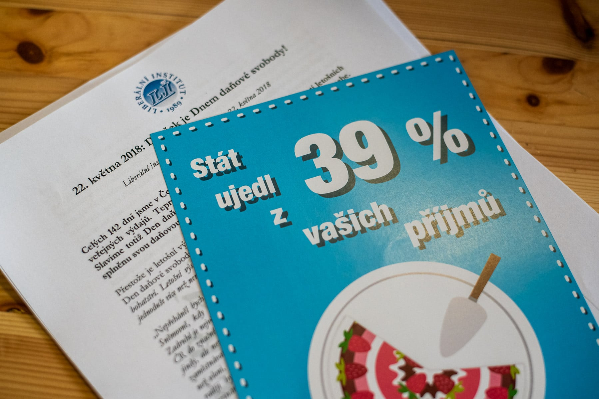
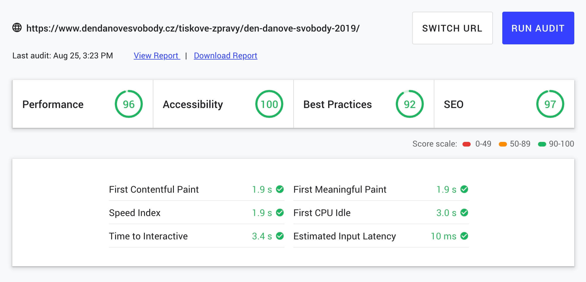

## Proč
Když mě [Mmister](https://twitter.com/mmister) zastavil u baru v Cevru, že by potřebovali v [Libinstu](https://libinst.cz/) novej web pro [Den daňové svobody](https://www.dendanovesvobody.cz/), že ten starej je pomalej a needitovatelnej, tak jsem je odkázal na Wordpress, ale že já to dělat nechci. Uběhlo pár dní a Martin se ozval znovu, jestli se na to nechci podívat. Mně se mezitím rozleželo v hlavě, jakým způsobem to udělat, aby se nemuselo používat komplikovaný CMSko. Už nějakou dobu jsem koukal po [Gatsbym](https://www.gatsbyjs.org/), ale neměl jsem reálnej projekt, na kterým ho vyzkoušet.
## Gatsby
> My website is faster than yours

Tenhle claim nepoužívá Gatsby jen tak pro nic za nic.

Ale co je vlastně Gatsby. Jde o static site generator postavenej na Reactu, webpacku a GraphQL. Má vyřešené routování, optimalizaci assetů a díky hromadě [pluginů](https://www.gatsbyjs.org/plugins/) mnoho dalšího (translace, formuláře, napojení na různá CMS). Pro srovnání, je to tak trochu [Jekyll](https://jekyllrb.com/) na drogách s výhodami Reactu s možností tahat data odkudkoliv. A tomuhle celýmu ekosystému se říká [JAMstack](https://jamstack.org/) (Javascript, API, Markup).

## Den daňové svobody
Původní web byl zbytečně komplikovanej se spoustou podstránek, kde byla například jen jedna věta. Jelikož rád škrtám, tak jsem to zrušil skoro všechno a na webu jsou jen tři druhy stránek: úvodní, detail tiskové zprávy a kontakt. Detail tiskové zprávy navíc obsahuje vše, co je na úvodní stránce a v kontaktu a zároveň to stále působí méně přehlceně než původní web.

Jelikož byl rozpočet dost omezenej, tak jsem dal grafiku dohromady za jeden páteční večer a za sobotu jsem měl kostru webu hotovou. To bylo vlastně největší překvapení, jak rychle se v Gatsby dá postavit web, kterej si všechna data tahá z markdown souborů (aby mohl být později napojen na CMS).

### Kalendář
Jeden z požadavků byl graf s jednotlivými roky a počtem dnů, na které vycházel Den daňové svobody. Toho jsem se asi bál nejvíc. Použít nějakou React knihovnu na vytváření grafů? Hmm. Raději ne. Nejjednodušší řešení bývá občas nejtěžší vymyslet. Ale po pár hodinách trápení s knihovnami mi to došlo.

Do hlavičky markdown souboru s tiskovou zprávou přidám položku s počtem dní pro stát a pak jenom vypíšu seznam tiskových zpráv, kde výšku grafu v pixelech udělá počet dní pro stát. Voilà. A graf bude zároveň sloužit jako rozcestník pro jednotlivé tiskové zprávy.

Jak ale udělat, aby graf začínal nejstarším ročníkem, ale vidět byl ten aktuální? Stačí vypsat ročník od nejnovějšího a otočit pořadí pomocí direction: rtl;. Nejdřív jsem zkoušel flex-direction. To také fungovalo, dokud jsem nepustil IE11. To nezvládá kombinaci flex-direction a overflow: scroll.

https://codepen.io/milianriedel/pen/BaBWpRN

## Netlify
Teď to někam nasadit. Na Twitteru komunita okolo Gatsby často zmiňuje [Netlify](https://www.netlify.com/). Pro mé účely stačil free účet, tak proč to nezkusit. A vyplatilo se to. Nasazení bylo rychlejší než napsat tenhle odstavec. Tohle má Netlify parádně zmáknutý. Propojíte Github s repozitářem a hotovo. Web je za chvíli nasazen. Na pull requesty se automaticky vybuildí dočasná verze na vlastní adrese pro QA. Přesměrování domény je taky snadné včetně free Let’s Encrypt certifikátu.

Netlify toho ale nabízí mnohem víc: formuláře pro statické weby, lambda funkce, autentifikaci a vlastní CMS a vše v použitelné verzi zdarma. Navíc podpora reaguje do jednoho dne a skutečně problémy řeší.

## Netlify CMS
Jeden z požadavků byla možnost si vše editovat. Jak jsem psal výše, tak Netlify poskytuje zdarma statické [CMSko](https://www.netlifycms.org/). Integrace je docela snadná a existuje i [Gatsby Netlify Starter](https://github.com/netlify-templates/gatsby-starter-netlify-cms) šablona, takže statický web s vlastním CMS je hotovej během pauzy na kafe.

Jelikož se jedná o statické CMS, tak neexistuje žádná databáze. Je to celé postavené na git workflow a změny se mergují do masteru.

Při načtení CMS si systém načte obsah markdown souborů, které je možné editovat a vytvářet. Skoro celá konfigurace se nachází v [yaml](https://github.com/netlify-templates/gatsby-starter-netlify-cms/blob/master/static/admin/config.yml) souboru, kde se definují jednotlivé položky CMS. Krom příspěvků je možné přidat editování i třeba pro položky menu, statické stránky, nahrávat obrázky do fotogalerie, loga v patičce, pdf soubory atd. Zároveň lze zakázat, které položky se nesmí smazat a které se nesmí vytvářet nové (aby se například nerozbil layout webu).

Lze i povolit takzvaný redakční mód, kdy se při vytvoření příspěvku vytvoří pull request (a nová verze webu na vlastní adrese) a zamerguje se až po schválení konkrétní osobou.

## Závěr
Použít Gatsby s Netlify a jejich CMS bylo od první chvíle jednoduché a komunita je velká a skutečně žije, takže většinu problémů už někdo řešil.

Navíc tenhle projekt pomohl při výběru našeho stacku v [Blueberry](https://www.blueberry.io/) při vytváření malých a středních webů. Jen Netlify jsme vyměnili za [AWS S3](https://www.blueberry.io/services/development/aws) pro hosting a [CircleCI](https://circleci.com/) pro deployment proces.

Za mě tedy Gatsby rozhodně doporučuji a těším se, kam se celej stack posune v budoucnu.
