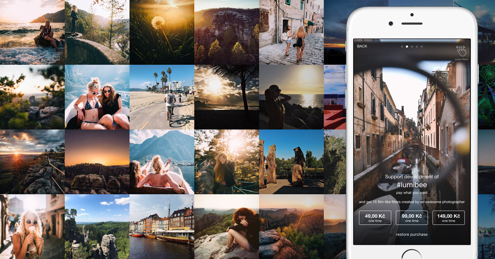
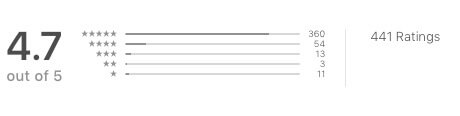
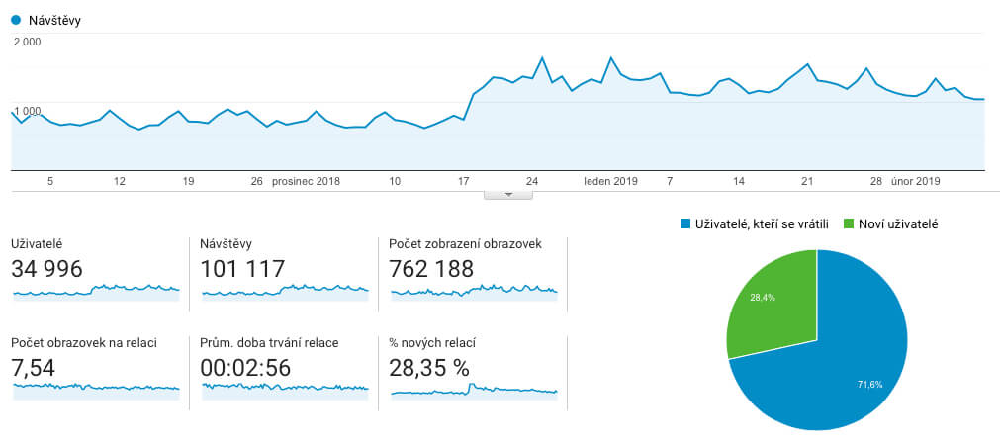
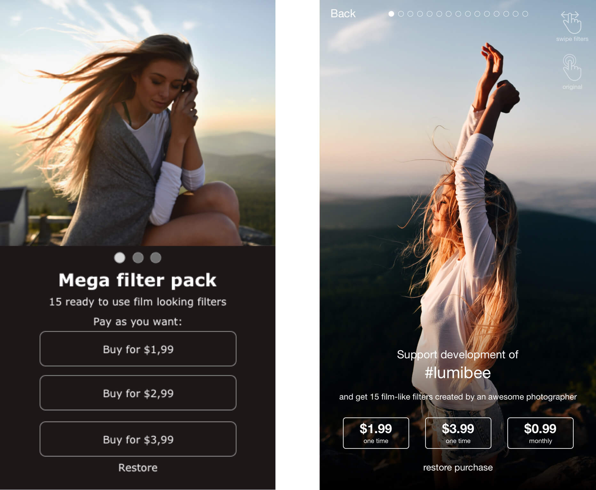

Občas se mě někdo zeptá, jak to jde s [Lumibee](https://itunes.apple.com/us/app/lumibee-fast-photo-editor/id1072221149?mt=8).

Lumibee jsme dali s Tomášem v létě 2017 definitivně zdarma, páč na marketing jsme leví a bylo smutné sledovat, jak noví uživatelé přibývají po jednom, tu po dvou za den.

Lumibee si začalo od té doby žít vlastním životem a nijak zvlášť jsme ho nesledovali. Uživatelé ze začátku naskakovali po stovkách až tisícovkách, ale po pár týdnech to opadlo. Sem tam nás Apple zařadil do nějakého [výběru](https://itunes.apple.com/us/story/id1355070858), což přineslo další uživatele, ale nic dechberoucího.

Alespoň pozitivní recenze pomalu přibývaly:

> **Great fast photo editor!** 
> The beauty of Lumibee is its super-efficient user interface.  What a great way to try out filters—just swipe up!  It has all the necessary editing tools one needs for casual photo editing.  Only request is please make it in landscape mode for iPad use.

> **Simple and great!**
> Such simple and cool interface! Editing tools is fine - for such simplicity I mean. And best of all - it's size is "just" 25mb! What a discovery this app is!

> **Get this app!**
> I've said it many times on social media, this app does what it says and allows you to go through the edit process very quickly. Tomáš and Milian have hit the nail on the head with a quick editing app for your iPhone photography. The only editing app I have on my iPhone 8 Plus aside from the stock Photos app.

Trochu se to změnilo před vánoci, kdy z průměrného počtu uživatelů kolem 600 denně to skočilo na cca 1100 a od té doby to nekleslo. Řekli jsme si, že tohle je možná poslední příležitost s tím něco udělat.

Měli jsme dvě možnosti. Přidat do aplikace reklamy a mít možnost je pomocí in-appů odstranit, nebo si říct o nějakej dobrovolnej příspěvěk.

Vybrali jsme si druhou možnost s tím, že za to uživatelé dostanou nové filtry. Sedli jsme si jeden večer s Radkem Kudláčkem ([hit that follow button!](https://www.instagram.com/radek_kudlacek/)) a vytvořili jsme 15 skvělejch filtrů.

To byla ta jednoduchá část. Teď je to potřeba převést nějak do kódu a iOS development je pakárna.
Tomáš z toho ale byl tak nadšenej, že si nakreslil návrh obrazovky pro in-appy. A jelikož bylo po obědě a mně se ještě nechtělo pracovat (rozuměj, nemohl jsem to nechat v tomhle stavu), tak jsem otevřel Sketch a překreslil to do trochu hezčí podoby.

## Návrh obrazovky:
- tři možnosti podpory, jedna z nich opakovaná (nejlepší!)
- možnost náhledu filterů
- možnost vidět neupravenou fotku

### Tři in-appy

O tomhle byla nejsnažší diskuse. Zároveň je to nejvíc práce.

### Možnost náhledu filterů

Ideální, když se načte uživatelova fotka a na tu se budou aplikovat filtry plus bude možnost porovnat s neupravenou fotkou. Zavrhnuto, že s tímhle se srát nebudeme.
Další možnost je obyčejnej carousel a rozhodovali jsme se, jestli tam dáme jednu fotku 15x pokaždé s jiným filterem, nebo jestli tam dáme 5 různých fotek. Vybrali jsme druhou variantu, jelikož nám přišla víc eye-catching. A hlavně jsme dostali od Radka několik skvělejch fotek.

### Možnost vidět neupravenou fotku

Zavrhnuto. Moc práce.

## Teď už to jen naprogramovat

Tomáš původně vyhrožoval, že iOS vývoj ho zas tak moc nebaví a hotové to bude možná někdy na jaře. Ale nakonec ho to stálo jen 20 nocí a 61 commitů.

Ale to by nebyl Apple, aby nám do toho nějak nehodil vidle.

V neděli večer přišel zamítavej mail. V pondělí další. Nakonec se jim nelíbil měsíční in-app, že by to mohl být scam. A navíc bychom museli přidat obrazovku se spoustou textu a vysvětlení, takže jsme se rozhodli, že tam budou tři jednorázové platby.

## A takhle to vypadá

Verze 1.7 [Lumibee už je v App Store]((https://itunes.apple.com/us/app/lumibee-fast-photo-editor/id1072221149?mt=8)) a pokud ji ještě nemáte v iPhonu, tak to rychle napravte! A že jste to přečetli, tak tady máte 4 redeem kódy (první přijde, první bere a je pak potřeba kliknout v appce na „restore purchases”):

KY9A9PFHAHXP

HAYRYWMKYLT3

FJ7RLLJR3KKN

7HMX7NF6FP9N

Článek časem doplním o nějaká čísla, jestli si to vůbec někdo koupil. Případně pokud někoho bude cokoliv zajímat ohledně Lumibee, tak to sem přidám.

A samozřejmě sledujte [Lumibee na instagramu](https://www.instagram.com/lumibeephoto/), sledujte tam i [Radka](https://www.instagram.com/radek_kudlacek/) a [podpořte vývoj Lumibee](https://itunes.apple.com/us/app/lumibee-fast-photo-editor/id1072221149?mt=8). A pokud vás aplikace baví, tak o ni řekněte dál.
