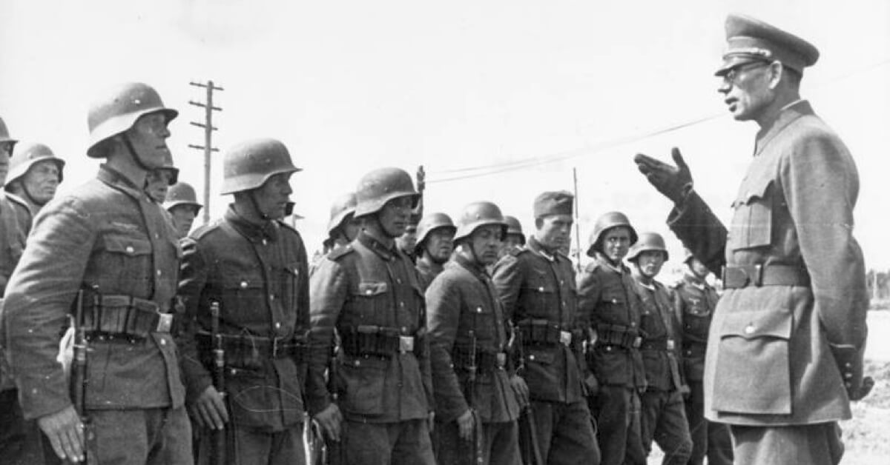

Níže uvedené citace pochází z knihy [Souostroví Gulag](https://www.databazeknih.cz/knihy/souostrovi-gulag-souostrovi-gulag-1918-1956-91547) od Alexandra Solženicyna

_Stalin odmítl podepsat Ženevskou úmluvu o zacházení s vězni. A proto s nimi Němci zacházeli nejhůře ze všech zajatců. Zároveň každého, kdo padl do zajetí, označil Stalin za vlastizrádce._

> Jenom náš voják, zavržený svou vlastí a nejposlednější v očích nepřátel i spojenců, stál o šlichtu pro prasata, vyvařovanou z odpadků Třetí říše. Jen pro něho byly dveře k domovu pevně zabouchnuty, i když se tomu mladé duše snažily nevěřit: prý je nějaký § 58/1b, jenž ve válečné době nepřipouští menší trest než zastřelení! Za to že voják nechtěl zemřít německou kulkou, musí po návratu ze zajetí zemřít sovětskou! Jiní umírají cizími kulkami, ale my vlastními!

> Tak tedy – jaké cesty byly ruským zajatcům otevřené? Ze zákonných jen jedna: lehnout si a nechat se rozdupat. Zemři teď, třebas s opožděním, když už jsi neuměl umřít na válečném poli, a pak tě nebudou soudit.

> Pokud se dá dnes zjistit, Andrej Andrejevič Vlasov nedokončil po revoluci kněžský seminář v Nižním Novgorodu, byl v roce 1919 odveden do Rudé armády a bojoval jako řadový voják. V bojích proti Děnikinovi a Wrangelovi na jižní frontě povýšil na velitele čety a pak roty. Ve dvacátých letech absolvoval kursy Vyslrel, v roce 1930 se stal členem VKS(b) a v roce 1936, už v hodnosti velitele pluku, byl poslán jako vojenský poradce do Číny. Zřejmě nebyl nijak spjat s vyššími vojenskými a stranickými kruhy, a proto se přirozeně octl v onom stalinském „druhém sledu“, který nahradil vyvražděné velitele armád, divizí a brigád. V roce 1938 dostal divizi a v roce 1940 při prvním udílení „nových“ (čili starých) vojenských hodností se stal generálmajorem. Z dalšího lze usoudit, že v oné nové generálské směně, v níž bylo mnoho naprosto omezených a nezkušených důstojníků, patřil Vlasov k nejschopnějším. Jeho 99. střelecká divize, kterou cvičil a připravoval do léta 1940, nebyla hitlerovským útokem nikterak překvapena, naopak: za našeho všeobecného ústupu na východ pronikla jeho divize na západ, dobyla Přemyšl a držela jej šest dnů. Vlasov přeskočil funkci velitele sboru a jako generálporučík velel už v roce 1941 u Kyjeva 37. armádě. Probil se z obrovského kyjevského kotle a v prosinci 1941 velel u Moskvy 20. armádě, jejíž úspěšný protiútok na obranu hlavního města (dobytí Solněčnogorska) je zaznamenán v denním hlášení Sovinformbyra ze dne 12. prosince 1941 (generálové jsou tam jmenováni v tomto pořadí: Žukov, Leljušenko, Kuzněcov, Vlasov, Rokossovskij, Govorov).

> S rychlostí, příznačnou pro ony měsíce, se stačil ještě v prosinci stát zástupcem velitele volchovského frontu (Mereckova) a převzít velení 2. úderné armády, v jejímž čele zahájil 7. ledna 1942 pokus o prolomení leningradské blokády ofenzívou severozápadním směrem přes řeku Volchov.
> Měla to být kombinovaná operace z několika stran i od Leningradu, a v kooordinovaných termínech se jí měly účastnit také 54., 4., a 52. armáda.
> Avšak tyto tři armády se buď vůbec nehnuly z místa, neboť ve stanovenou dobu nebyly ještě připravené, nebo se rychle zastavily (u nás tehdy ještě neuměli takové složité operace plánovat a hlavně zásobovat.) Jen 2. úderná armáda zaútočila úspěšně a v únoru 1942 pronikla za německé postavení do hloubky 75 kilometrů! A od tohoto okamžiku nemělo ani pro tuto armádu Stalinovo vrchní hazardérské velitelství ani posily ani munici. (S takovými rezervami zahájilo ofenzívu!) Tak zůstal i Leningrad dále o hladu v blokádě, aniž se dozvěděl něco bližšího o novgorodských událostech. V březnu se ještě držely zimní cesty, ale v dubnu rozbředl celý ten bahnitý terén, v němž se pohybovala 2. úderná armáda, a tak neměla žádné zásobovací cesty ani pomoc ze vzduchu. Jeho armáda zůstala bez proviantu – a přitom Vlasovovi odmítli dát povolení k ústupu! Po dvouměsíčním hladovění a vymírání (vojáci, kteří to přežili, mi pak v butyrských celách vyprávěli, že ostrouhávali kopyta zdechlých hnijících koní, vařili to a jedli) začal 14. května soustředěný německý útok proti obklíčené armádě (a ve vzduchu byla samozřejmě jen německá letadla!). A teprve tehdy (jako na výsměch) dostal Vlasov povolení k ústupu za řeku Volchov… Beznadějné pokusy probít se zpět trvaly do začátku července.
> Tak – jako by opakovala osud ruské Samsonovovy 2. armády, která byla za první světové války stejně šíleně vržena do jistého obklíčení – zanikla Vlasovova 2. úderná armáda.
> Samozřejmé že to byla vlastizrada! Samozřejmě že to byla krutá, bezohledná zrada! Byla to však zrada Stalinova! Zrada neznamená nutně zaprodanost.

_Stalin nabídl, že pošle pro Vlasova letadlo a „zachrání ho“, ale ve skutečnosti ho chtěl nechat popravit._

> Když nejvyšší velitel projeví neschopnost a nedbalost při přípravách k válce, bezhlavost a zbabělost na jejím počátku, když nesmyslně obětuje armády a sbory jen pro záchranu vlastní maršálské uniformy – může se snad dopustit větší zrady?
> Na rozdíl od Samsonova nespáchal Vlasov sebevraždu. Po zániku armády bloudil ještě v lesích a bažinách a dne 6. července se v okolí Siverské vzdal Němcům. Ti ho odvezli do hlavního stanu u města Ltitzen ve Východním Prusku, kde už bylo shromážděno několik zajatých generálů a brigádní komisař G. N. Žilenkov (dříve úspěšný stranický pracovník, tajemník jednoho z moskevských obvodních výborů strany). Ti všichni už projevili svůj nesouhlas s politikou Stalinovy vlády. Chyběla však skutečná vedoucí osobnost. A tou se stal Vlasov.

> …téměř až do samého konce války žádná ROA neexistovala. Její název i znak na rukávech si vymyslel jeden Němec ruského původu, kapitán Strik-Strikfeldt z Ostpropaganda Abteilung. (Měl sice bezvýznamnou funkci, ale značný vliv, a snažil se přesvědčit hitlerovské špičky o nutnosti německoruského spojenectví a získat Rusy pro spolupráci s Německem. Byla to oboustranně marná námaha! Obě strany se jen hleděly vzájemně využít a oklamat. Němci však při tom stáli nahoře, měli moc, kdežto vlasovským důstojníkům zbývalo jen fantazírování na dně propasti.) Žádná taková armáda neexistovala.

> Ve Východním Prusku vedli pár kroků ode mne po okraji silnice tři zajaté vlasovce, když kolem právě zarachotil T-34. Jeden ze zajatců se najednou odtrhl, skočil a vrhl se šipkou pod tank. Tank hned uhnul, ale přesto ho zachytil okrajem pásu. Přejetý se svíjel, červená pěna mu šla z úst. A člověk ho chápal! Dal přednost vojácké smrti před oprátkou v mučírně.

> Zbabělec hledá úlevy a shovívavost. Do „vlasovských“ oddílů wehrmachtu mohla tyto lidi přivést jen nejvyšší nouze, jen bezmezné zoufalství, jen neutuchající nenávist k sovětskému režimu, jen pohrdání vlastním životem. Oni totiž věděli, že jim nezasvitne žádný paprsek milosti! V našem zajetí je stříleli, jakmile zaslechli první zřetelné ruské slovo z jejich úst. V ruském zajetí se stejně jako v německém nejhůř ze všech vedlo Rusům.
> Tato válka nám vůbec odhalila, že nejhorší ze všeho na zemi je být Rus.

> Obyvatelé okupovaných území pohrdali vlasovci jako německými žoldáky a Němci zas pro jejich ruskou krev. Jejich ubohé tiskoviny skloňovaly po opracování německou cenzurní sekyrou jen dvě slova: Velkoněmecko a Vůdce. A tak zbývalo vlasovcům jen bojovat na život a na smrt, a ve volném čase vodka a zase vodka. Odsouzenost k zániku – to byl pocit, s nímž žili po všechna ta léta války a ciziny, a žádné východisko neměli.

> 1944 se začaly formovat vlastní vlasovské čistě ruské divize. Moudří němečtí politikové se pravděpodobně domnívali, že se teď ruští „ostarbajtři“ budou hrnout pro zbraně. To už Rudá armáda stála u Visly a u Dunaje… A jako na výsměch, jako by vlasovci chtěli potvrdit prozíravost nejneprozíravějších Němců, prvním a zároveň posledním samostatným činem těchto vlasovských divizí byl úder… proti Němcům! Za všeobecného rozkladu a bez dohody s německým oberkommandem soustředil Vlasov koncem dubna 1945 své dvě a půl divize u Prahy. Tu se rozšířila zpráva, že se esesácký generál Schórner chystá zničit hlavní město Československa, dříve než je přenechá nepříteli. Vlasov dal rozkaz svým divizím, aby se přidaly k povstalým Čechům. A všechnu křivdu, trpkost a zlost, jež se za tato tři krutá a nesmyslná léta nahromadily vůči Němcům v porobených ruských duších, si teď vlasovci vylili v útoku na Němce: napadli je z nečekané strany a vyhnali z Prahy. (Zdali všichni Češi pak pochopili, kteří Rusové zachránili jejich město? U nás jsou dějiny překrouceny a říká se, že Prahu zachránila sovětská vojska, ačkoliv to ve skutečnosti ani nemohla stihnout.) Pak začali vlasovci ustupovat směrem k Američanům, do Bavorska: jedinou jejich nadějí byli spojenci – že se budou spojencům nějak hodit čímž jejich dlouholeté houpáni v německé smyčce získá konečně nějaký smysl. Avšak Američané proti ním postavili ozbrojenou zeď a donutili je, aby se vzdali do rukou sovětů, jak bylo dohodnuto na jaltské konferenci. Ve stejném měsíci květnu 1945 učinil v Rakousku i Churchill tentýž loajální spojenecký krok (o němž se u nás s obvyklou skromností pomlčelo): Předal sovětskému velitelství kozácký sbor o devadesáti tisících mužů i s celým trénem – se starci, dětmi a ženami, kteří se nechtěli vrátit k rodným kozáckým řekám. (Veliký muž, jehož pomníky budou později zdobit celou Anglii, nařídil také je vydat na smrt.) Samo toto předání se odehrálo zákeřným způsobem v duchu tradiční anglické diplomacie. Kozáci totiž byli odhodláni bojovat na život a na smrt nebo odjet za oceán třeba do Paraguaye nebo do Indočíny, jen se nevzdat živí. Proto je Angličané nejdřív vyzvali, aby odevzdali zbraně pod záminkou ujednocení jejich výzbroje. Potom pozvali důstojníky odděleně od vojáků na údajnou poradu o budoucím osudu jejich armády do Judenburgu v britském okupačním pásmu – ale v noci před tím postoupili Angličané tajně toto město sovětským vojskům.

> Čtyřicet autobusů s důstojníky, od velitelů rot až po generála Krasnova, přejelo po vysokém viaduktu a vjelo přímo do polokruhu vězeňských vozů, vedle nichž už stál ozbrojený doprovod se seznamy v rukou. Cestu zpět zatarasily sovětské tanky.
> A důstojníci neměli, čím by se mohli zastřelit nebo probodnout – všechny zbraně jim byly odebrány. Vrhali se z viaduktu dolů na dlažbu. Potom Angličané stejně úskočně předali i řadové vojáky – ve vlacích (údajně je poslali k jejich velitelům převzít zbraně).

> … Slovo „vlasovec“ u nás zní podobně jako slovo „hnůj“, zdá se nám, že sám tento zvuk poskvrňuje naše rty, a proto se nikdo neopovažuje ani vyslovit pár vět na toto ožehavé téma.
> Takto se však dějiny nepíšou. Dnes, o čtvrt století později, kdy většina z nich už zahynula v lágrech a zbylí dožívají na dalekém severu, chtěl bych těmito stránkami připomenout, že je to ve světových dějinách dost neobvyklý jev, aby několik set tisíc mladých lidí ve věku od dvaceti do třiceti let pozvedlo zbraně proti své vlasti po boku jejího největšího nepřítele. Že je snad třeba se zamyslet nad tím, kdo má větší vinu – tato mládež, nebo šedovlasá Vlast? Že se to nedá vysvětlit lidskou povahou, nýbrž že tu musí být společenské příčiny.

`youtube:https://www.youtube.com/embed/Gc0pL9P9Ea8`
